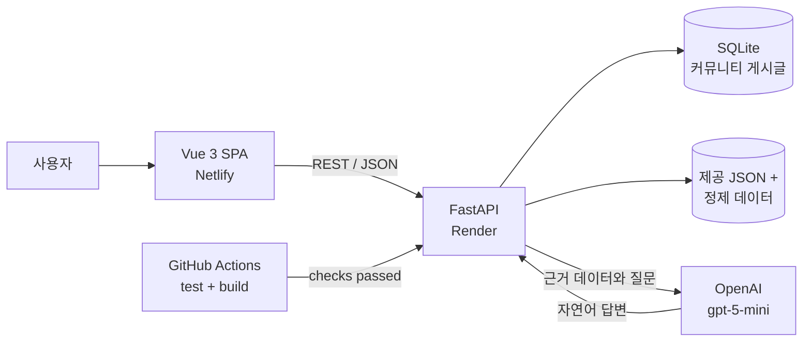
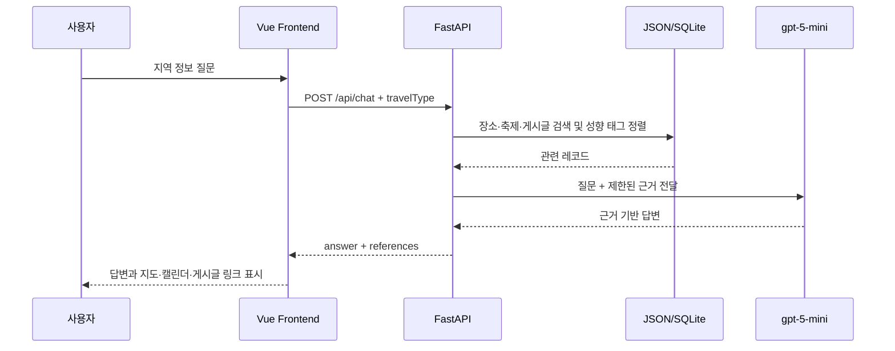
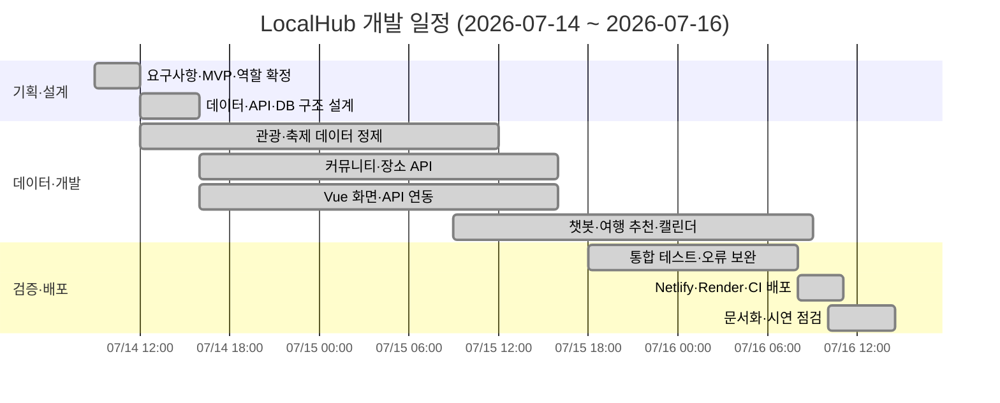

# LocalHub

> 구미·경북권의 관광 정보, 축제 일정, 익명 커뮤니티와 AI 여행 도우미를 한곳에서 제공하는 지역 정보 플랫폼


| 구분 | 주소 |
|---|---|
| Frontend | https://cosmic-clafoutis-8894bf.netlify.app |
| Backend API | https://start-camp-16-6.onrender.com/api |
| Swagger | https://start-camp-16-6.onrender.com/docs |

## 프로젝트 개요

LocalHub는 흩어져 있는 구미·경북권 지역 정보를 제공된 JSON과 검증한 파생 데이터로 정리하고, 사용자 취향에 맞는 장소와 축제를 탐색할 수 있도록 만든 Vue·FastAPI 기반 SPA입니다. 로그인 없이 게시글을 작성할 수 있으며, 작성 시 입력한 비밀번호로 수정·삭제 권한을 확인합니다. 챗봇은 백엔드에서 검색한 장소·축제·커뮤니티 데이터와 브라우저에 저장된 여행 성향을 근거로 OpenAI `gpt-5-mini`를 호출합니다.

- 개발 기간: 2026-07-14 ~ 2026-07-16
- 대상 지역: 구미, 대구, 칠곡, 성주, 고령
- 대상 사용자: 구미·경북권 관광객 및 지역 주민
- 핵심 목표: 지역 정보 탐색, 익명 정보 공유, 근거 기반 AI 질의응답

## 주요 기능

| 기능 | 설명 | 주요 API |
|---|---|---|
| 지역 장소 탐색 | 지역·유형·키워드별 관광 데이터 목록 및 상세 조회 | `GET /api/places` |
| 장소 지도 | Leaflet·OpenStreetMap 기반 마커 클러스터, 좌표 이동 및 상세 연결 | `GET /api/places` |
| 축제 캘린더 | 정제한 30개 축제 일정을 월별·지역별로 조회 | `GET /api/festivals` |
| 익명 커뮤니티 | 게시글 작성·조회·수정·삭제, 카테고리·검색·조회수·추천 수 | `/api/posts` |
| AI 챗봇 | 장소·축제·게시글과 여행 성향에 근거한 답변, 지도·캘린더·게시글 연결 | `POST /api/chat` |
| 여행 취향 테스트 | 5개 질문으로 유형을 계산하고 상위 장소를 추천 | `/api/travel-test` |

## 서비스 구조



챗봇의 모델 선택과 추천 순위 계산을 분리했습니다. 여행 유형·추천 순위는 재현 가능한 코드로 계산하고, OpenAI는 검색된 근거 안에서 답변 문장을 생성합니다. 여행 성향은 브라우저에 저장되어 채팅 요청의 `travelType`으로 전달되며, 명시한 지역·장소 조건 안에서 일치 태그가 많은 장소를 우선합니다. API 키는 브라우저에 전달하지 않습니다.

## 기술 스택

| 영역 | 기술 | 사용 목적 |
|---|---|---|
| Frontend | Vue.js 3, Vue Router, Vite, Axios | SPA 화면, 라우팅, API 통신 |
| Map·Calendar | Leaflet, Leaflet.markercluster, OpenStreetMap, Esri fallback, FullCalendar | 장소 위치와 축제 일정 시각화 |
| Backend | Python 3.11, FastAPI, Uvicorn, Pydantic | REST API와 데이터 검증 |
| Database | SQLAlchemy, SQLite | 익명 커뮤니티 게시글 관리 |
| AI | OpenAI API, `gpt-5-mini` | 검색 근거 기반 챗봇 답변 |
| Test | Pytest, HTTPX, Vite build | API 회귀 테스트와 FE 빌드 검증 |
| CI/CD | GitHub Actions, Render, Netlify | 검사 통과 후 백엔드 배포, FE 배포 |

## 데이터 흐름



## 팀 구성 및 역할

| 참여자 | 담당 | 주요 작업 |
|---|---|---|
| 류효정 | 데이터 정제, FE | 관광·축제 데이터 검증 및 정제, 여행 추천 데이터, FE 화면·데이터 연동 |
| 오성식 | FE | Vue 화면, 공통 컴포넌트, 라우팅, 커뮤니티·챗봇 UI |
| 채원형 | BE | FastAPI, SQLAlchemy·SQLite, API·OpenAI 연동, 테스트·배포 구성 |

API 스키마, 환경 변수, 배포처럼 여러 영역에 영향을 주는 변경은 담당자 간 검토 후 반영합니다.

## 일정 및 WBS



| 단계 | 담당 | 완료 기준 |
|---|---|---|
| 요구사항·MVP | 팀 전체 | 필수/선택/제외 범위 및 역할 확정 |
| 데이터 정제 | 류효정 | 데이터 정제, 태그 생성, 추천 로직 구성 |
| FE 개발 | 류효정, 오성식 | 주요 화면·모바일 UI·API 연동 동작 |
| BE 개발 | 채원형 | API·DB·OpenAI 연동 및 예외 처리 |
| 통합·배포 | 팀 전체 | CI, 배포 URL, 핵심 사용자 흐름 검증 |

## 저장소 구조

```text
start_camp_16_6/
├─ frontend/              # Vue 3 SPA
│  └─ src/
│     ├─ api/             # 중앙 API 클라이언트
│     ├─ components/      # 공통 UI
│     └─ views/           # 라우트 화면

├─ backend/
│  ├─ app/
│  │  ├─ api/             # FastAPI 라우터
│  │  ├─ models/          # SQLAlchemy 모델
│  │  ├─ schemas/         # Pydantic 스키마
│  │  └─ services/        # 검색·추천·비즈니스 로직
│  └─ tests/
├─ data/
│  ├─ raw/                # 제공 원본(수정 금지)
│  └─ derived/            # 검토한 날짜·태그·추천 데이터
├─ docs/                  # API·프로젝트·테스트 명세
├─ scripts/               # 로컬 실행 스크립트
└─ .github/workflows/     # GitHub Actions CI
```

## 로컬 실행

### 1. 환경 변수

루트의 `.env.example`을 복사해 `.env`를 만들고 실제 키는 `.env`에만 입력합니다.

```env
DATABASE_URL=sqlite:///./localhub.db
CORS_ORIGINS=http://localhost:5173
OPENAI_API_KEY=your_key
OPENAI_MODEL=gpt-5-mini
VITE_API_BASE_URL=http://localhost:8000/api
```

### 2. 통합 실행 스크립트(Windows PowerShell)

```powershell
.\scripts\local-dev.ps1
```

같은 터미널을 즉시 돌려받고 서버는 백그라운드에서 시작하려면:

```powershell
.\scripts\local-dev.ps1 -NoWait
```

- Frontend: http://localhost:5173
- Swagger: http://localhost:8000/docs
- 실행 로그: `.local/`

서버 종료:

```powershell
.\scripts\local-dev.ps1 -Stop
```

## 테스트와 배포

```powershell
# Backend
$env:PYTHONPATH="$PWD\backend;$PWD"
python -m pytest backend/tests tests -q

# Frontend
Set-Location frontend
npm ci
npm run build
```

GitHub Actions는 `main` 대상 push와 pull request에서 백엔드 테스트 및 프론트엔드 빌드를 실행합니다. Render의 `autoDeployTrigger: checksPass` 설정으로 CI 검사가 성공한 커밋만 백엔드에 자동 배포됩니다.

## 문서

- [프로젝트 운영·범위 가이드](docs/PROJECT_GUIDE.md)
- [API 명세](docs/API_SPEC.md)
- [여행 취향 테스트 명세](docs/TRAVEL_TEST_SPEC.md)
- [챗봇 연결형 예시 질문](docs/CHATBOT_QUESTION_EXAMPLES.md)
- [Frontend 작업 가이드](frontend/FRONT_GUIDE.md)
- [Backend 작업 가이드](backend/BE_GUIDE.md)
- [원본 데이터 출처](data/raw/SOURCE.md)

## 보안 및 데이터 원칙

- `.env`, OpenAI API 키, 로컬 DB는 Git에 커밋하지 않습니다.
- 원본 JSON은 수정하지 않고, 날짜·태그 등 검증한 값은 `data/derived/`에서 `contentId`로 연결합니다.
- 게시글 비밀번호는 교육용 요구사항에 따라 원문 저장하지만 API 응답과 로그에는 노출하지 않습니다.
- 챗봇은 검색 근거에 없는 일정·가격·연락처를 생성하지 않습니다.
- 지도는 OpenStreetMap 공개 타일을 기본으로 사용하고 연결 실패 시 Esri World Street Map으로 전환합니다. 타일 이미지는 저장소에 포함하지 않습니다.
- 현재 Render 설정의 SQLite 파일은 인스턴스 로컬 디스크에 저장되므로 재배포·재시작 시 영속성이 보장되지 않습니다. 운영 데이터 보존이 필요하면 Render Persistent Disk 또는 외부 관리형 DB로 이전해야 합니다.

## MVP 범위

| 우선순위 | 범위 |
|---|---|
| Must | 제공 JSON 기반 지역 정보, 익명 커뮤니티 CRUD, 챗봇 API·UI, Vue/FastAPI/SQLite, Netlify·Render 배포 |
| Should | 여행 취향 테스트와 맞춤 추천, 검증된 날짜 기반 축제 캘린더 |
| Could | 게시글 검색·조회수, 데이터 시각화 확장 |
| Won't | 회원·로그인, 날씨·경로 API, 실시간 알림, 다국어, 선정 외 권역 확장 |
